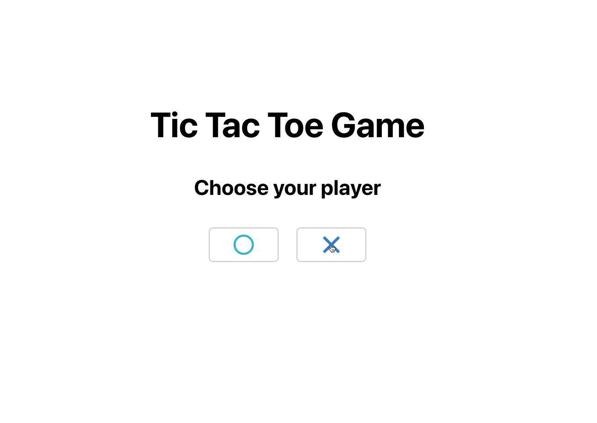

# Tic Tac Toe - React Typescript



[](https://tic-tac-toe-ruimartins.netifly.app)

## Introdution

This game was developed in React with Typescript and React Hooks. Let's go play the game 👨‍💻

## Features

The game has the following features:

 - Allow the player to reset the game at any point
 - Allow the player to choose 0’s or X’s to start with
 - When a player puts their 0 or X on the board, the next player should then be able to place their 0 or X and so on. 
 - If a player get’s 3 in a row horizontally, vertically or diagonally, they should be declared the winner and only a reset should be allowed.
 - If no player gets 3 in a row, then a stalemate should be declared and a reset allowed.
 - If the page is reloaded, the game should resume where it was left off.


# Run it locally

```sh
  # Clone this repository
  $ git clone https://github.com/ruimartins21/tic-tac-toe.git

  # Go into the repository
  $ cd tic-tac-toe

  # Install dependencies
  $ yarn # npm install

  # Run the app
  $ yarn dev # npm run dev
```
